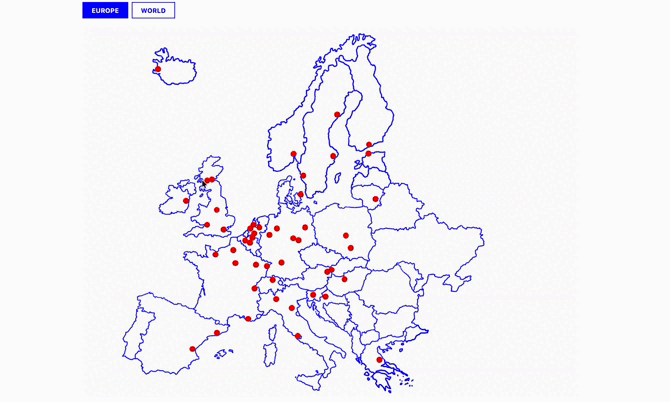
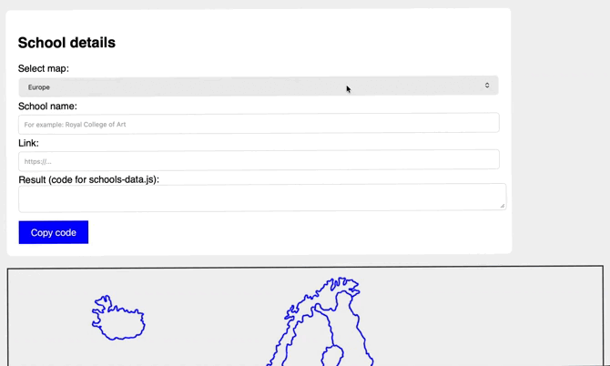

# UMPRUM PARTNER SCHOOLS MAP

An interactive map system developed for the Academy of Arts, Architecture and Design in Prague (UMPRUM). The project visualizes the university's global exchange network.

**[View Live Map](https://yunglordsimens.github.io/umprum-partner-map/)** | **[Open Data Generator](https://yunglordsimens.github.io/umprum-partner-map/generator.html)**

---

### / PREVIEW

---

### / PROJECT EVOLUTION (V1 → V2)

This project represents my growth from a visual designer to a Design Engineer.

**Version 1 (The Problem):**
Initially, I built the map using static HTML with hardcoded pixel coordinates (`top: 1040px`). While visually correct, it was:
* **Unmaintainable:** Adding a new school required calculating pixels manually.
* **Hard to scale:** The layout broke on different screen sizes.

**Version 2 (The Solution):**
I completely re-engineered the system to separate **Data** from **View**.
1.  **Architecture:** Migrated to a JSON-based data structure (`schools-data.js`).
2.  **Responsiveness:** Switched from `px` to relative `%` positioning, making the map fluid.
3.  **Tooling:** Developed a custom **Coordinate Generator** to automate the workflow for the university staff.
**My Solution:**
I re-engineered the architecture to split **Logic** (Interface) from **Data** (Content).

1.  **JSON-Based Architecture:** All school data is now stored in a separate `schools-data.js` file.
2.  **Responsive Positioning:** Migrated from absolute pixels (`top: 1040px`) to relative percentages (`top: 54%`), making the map fully responsive on any screen size.
3.  **Internal Tooling:** Built a custom **Coordinate Generator** tool to automate updates.

---

### / INTERNAL TOOL: COORDINATE GENERATOR

I developed a helper interface (`generator.html`) for the International Department staff. It allows non-technical users to:
1.  Click anywhere on the map.
2.  Input the school name and URL.
3.  Instantly generate the correct JSON code snippet.

---

### / CREDITS

* **Development & Architecture:** Maria Chernobay
* **Map Illustration:** Anna Ivakhno
* **Institution:** AAAD / UMPRUM (Prague)

### / TECH STACK

* **JavaScript (ES6)**
* **JSON Data Structure**
* **HTML5 / CSS3**
* **Custom Tooling**
